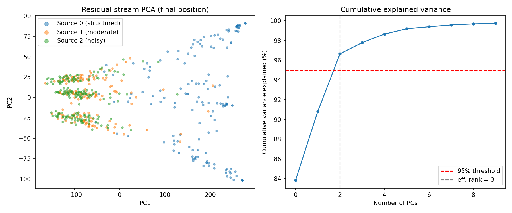
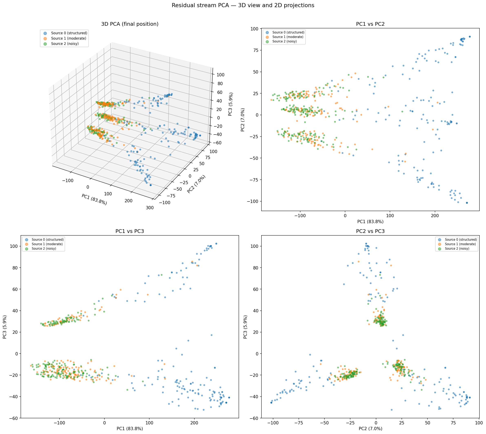
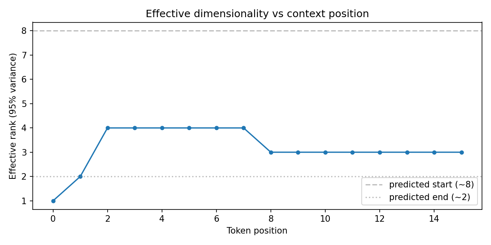
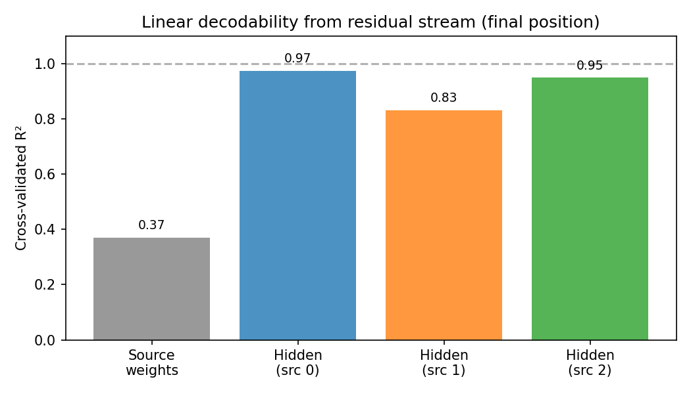

# Simplex Take-Home: Non-ergodic Mess3 Transformer Study

**Candidate:** Matthew Fong  
**Date:** 2026-04-15

---

## Task 1 — Experimental Setup

### Generative Process

I train a small transformer via next-token prediction on a **non-ergodic** dataset built from K=3 Mess3 hidden Markov models.  Each sequence in the training corpus is generated by exactly one randomly-chosen source; the joint process over sequences has no single stationary distribution.

**The three Mess3 sources** are parameterised by (a, x) where a controls diagonal dominance (autocorrelation) and x controls cross-emission probability:

| Source | a    | x    | Character |
|--------|------|------|-----------|
| 0      | 0.95 | 0.05 | Highly structured — stays in state, tokens very predictable |
| 1      | 0.60 | 0.15 | Moderate structure (Shai2026 parameters) |
| 2      | 0.30 | 0.25 | Noisy — rapid state mixing, tokens near-uniform |

**Mess3 transition tensor** (following fwh_core convention):

```
T[obs, state_from, state_to] = P(emit obs AND go to state_to | in state_from)
```

Each column of T_net = ∑_obs T[obs] sums to 1 (column-stochastic in state dimension).  For all three parameter choices the stationary distribution is uniform: π = [⅓, ⅓, ⅓] by the three-fold symmetry of Mess3.

**Belief update** at each observed token x_t:

```
b_t(s) ∝  (b_{t-1} @ T[x_t])[s]    (row-vector left-multiply then normalize)
```

**Vocabulary** {0, 1, 2, BOS=3}, vocab_size = 4.  BOS is prepended to every sequence; the model never predicts BOS.

### Model

A two-layer causal transformer (TransformerLens `HookedTransformer`):

| Hyperparameter | Value |
|---|---|
| d_model | 128 |
| n_heads / d_head | 4 / 32 |
| n_layers | 2 |
| d_mlp | 512 |
| n_ctx | 17 |
| seq_len (training) | 16 tokens + BOS |
| Activation | GELU + LayerNorm |

Total parameters: ~440k.  Small enough to train in <30 min on a single GPU.

### Training

- **Loss:** cross-entropy next-token prediction on tokens positions 1..T+1 (predict each observation from its context)
- **Optimiser:** AdamW, lr=1e-3, weight_decay=1e-4, β=(0.9, 0.95)
- **Schedule:** linear warmup (500 steps) → cosine decay to 10% lr
- **Steps:** 10,000 × batch_size=256 ≈ 2.56M token pairs

### Why is this structure interesting for language models?

Real language shouldn't be treated as ergodic. LLMs need to understand the context, theoretically identifying the latent parameters of the current sequence (e.g., style, topic, logic) to predict future tokens. A sequence from a scientific journal is different than a sequence from a social media post, and the model must track which generative process is active rather than averaging over all of them. 

The non-ergodic Mess3 setup is a minimal, fully controlled analogue of this domain and register structure: multiple distinct sources, each internally consistent, never mixed within a sequence. It is a clean test of whether transformers can perform hierarchical Bayesian inference. Inferring not just "what hidden state is the generator in" but "which generator is active." In natural language we cannot compute the ground-truth posterior over sources, but in this synthetic setting we can. This lets us ask precisely: does the model's residual stream track the correct Bayesian posterior, and does it do so in the orthogonal factored geometry the paper predicts?

If the factored world hypothesis extends to real LLMs (which the paper's inductive bias argument suggests it should) then the factors the model discovers may correspond to interpretable, separable aspects of language: topic, syntactic register, factual domain, or even properties like whether a claim is hedged or confident. If those factors live in orthogonal subspaces of the residual stream, they become readable and potentially adjustable independently. You could in principle identify the subspace encoding a model's uncertainty about a factual claim and intervene on it directly without disturbing anything else. The non-ergodic Mess3 experiment is the controlled proof-of-concept that makes that larger goal tractable to reason about formally.

### Other experiments with more time

The most direct extension would be applying CEV analysis to a large pretrained LLM's residual stream with no architectural modifications. Feed the model a large corpus of diverse text passages drawn from distinct domains (legal, scientific, literary, conversational), collect residual stream activations at each token position across all passages, and run PCA. Are the effective dimensionality consistent with a factored structure? Do passages from different domains cluster into distinct geometric regions?

A more targeted experiment would adapt the vary-one procedure to natural language using minimal pairs. Carefully construct text pairs that differ in exactly one property while holding everything else fixed. Pairs differing only in grammatical number, tense, or topic while preserving syntactic structure would let you approximately isolate candidate subspaces for specific linguistic factors and then test their pairwise orthogonality using the overlap metric from the paper.

---

## Task 2 — Pre-Registered Geometric Prediction

*All predictions written before any training run or residual stream analysis.*

### 2.1 What Makes This Setup Different From the Paper

The paper's main experiments study processes that are independent or conditionally independent, where multiple factors run in parallel, each contributing to every observed token simultaneously. The model's job is to track belief over all factors at once.

This setup introduces a qualitatively different structure: **non-ergodicity**. Each training sequence is generated by exactly one of three Mess3 sources, chosen at the start of the sequence and fixed for its entire length. No sequence ever switches sources mid-way. The joint process over sequences has no single stationary distribution, so the ensemble average is not the time average.

This means the model must perform **hierarchical inference**, simultaneously inferring which source is active and track the internal hidden state of that source. These are two nested levels of uncertainty.

---

### 2.2 Structure of the Optimal Belief State

The optimal predictor for this process must maintain an internal state sufficient to compute the next-token distribution at every position. That sufficient statistic is the joint belief vector:

$$\mathbf{b}_t = \bigl\{ w_k(t),\; \mathbf{h}_k(t) \bigr\}_{k=0}^{K-1}$$

where

$$w_k(t) = P(\text{source}=k \mid x_{1:t})$$

$$\mathbf{h}_k(t) = P(\text{hidden state} \mid x_{1:t},\; \text{source}=k) \in \Delta^2$$

- The source weights $w_k(t)$ form a distribution over $K=3$ sources, living in a 2-simplex $\Delta^2$. 
- Each per-source hidden state belief $\mathbf{h}_k(t)$ is a distribution over 3 Mess3 hidden states, also living in a 2-simplex $\Delta^2$.

Together, the full belief state covers $3K = 9$ combinations of (source, hidden state), constrained to sum to 1. 

The joint belief therefore lives in an 8-dimensional simplex:

$$\mathbf{b}_t \in \Delta^8 \subset \mathbb{R}^9, \qquad \dim = 3K - 1 = 8$$

This breaks down as $K - 1 = 2$ free source weights plus $2 \times K = 6$ free hidden state coordinates, one 2D simplex per source.

An important contrast with the paper: in their setting, $K$ parallel independent factors yield a factored representation that is exponentially more efficient than
the joint one. Here, $K$ non-ergodic sources in a mixture have the *same* total
dimensionality as the joint representation (8 dimensions either way). The question
is therefore not about dimensional savings but entirely about geometric structure
and organization.

---

### 2.3 Source Belief Dynamics

The source weights evolve via Bayesian updating driven by the likelihood ratio
between sources:

$$w_k(t) = \frac{w_k(0) \prod_{\tau=1}^t p_k(x_\tau \mid x_{1:\tau-1})}
{\sum_j w_j(0) \prod_{\tau=1}^t p_j(x_\tau \mid x_{1:\tau-1})}$$

Starting from a uniform prior $w_k(0) = 1/3$, the weight of the true source grows
as evidence accumulates. Under standard distinguishability conditions, the source
weight concentrates exponentially fast:

$$w_k(t) \to \mathbf{e}_k \quad \text{as} \quad t \to \infty$$

The rate of concentration is governed by the divergence between sources'
next-token distributions. The three sources have meaningfully different parameters:

| Source | $\alpha$ | $x$ | Character |
|--------|----------|-----|-----------|
| 0 | 0.95 | 0.05 | Highly structured, very predictable |
| 1 | 0.60 | 0.15 | Moderately structured |
| 2 | 0.30 | 0.25 | Near-uniform, noisy |

Source 0 produces strongly autocorrelated tokens and is identified fastest. Source 2
produces near-uniform tokens that are harder to distinguish from Source 1, so
disambiguation is slower. This asymmetry leads to a concrete prediction about which
cluster boundaries form earliest.

---

### 2.4 Geometric Predictions

#### Geometry of activations at long context

At late context positions, the residual stream should organize into $K = 3$
separated clusters in PCA space, one per source. Within each cluster, activations
should lie approximately on a 2-dimensional manifold, a distorted image of the
Mess3 belief simplex $\Delta^2$ for that source, consistent with the fractal simplex
geometry shown in Figure 2a of the paper.

If the transformer internalizes the factored structure of the generative process,
this cluster structure is the visible consequence of a deeper organization: the
residual stream partitions into 4 approximately orthogonal subspaces according to
the Factored World Hypothesis:

- **1 source subspace** (2D): encodes $w_k(t)$. The three clusters visible in PCA
  space are the three corners of this subspace's simplex $\Delta^2$, each
  corresponding to one source being identified.
- **3 hidden subspaces** (2D each): one per source, encoding $\mathbf{h}_k(t)$ as
  a copy of that source's Mess3 belief simplex $\Delta^2$.

Total predicted dimensions: $2 + 3 \times 2 = 8$. Pairwise subspace overlap
between any two of these four subspaces should be near zero. Expressed as an
overlap matrix, we predict values near the identity: diagonal $\approx 1$,
off-diagonal $\approx 0$.

The separation between the Source 0 cluster and the others should be largest, since
Source 0 ($\alpha=0.95$) is most statistically distinctive. Sources 1 and 2 should
be closer in activation space, particularly at shorter context lengths.

#### How activation geometry changes with context position

At position $t=0$ (after BOS, before any observations), the model has no
information about which source is active. The full 8-dimensional joint belief is
relevant and the residual stream should reflect this. As context accumulates and
$w_k(t)$ concentrates onto one source, the predictive state collapses toward a
single 2D simplex for the identified source. The predicted effective dimensionality
at each extreme is:

$$\text{eff-rank}(t=0) \approx 8, \qquad \text{eff-rank}(t \to \infty) \approx 2$$

This yields a novel testable prediction: **effective dimensionality is a
monotonically decreasing function of context position**, with the rate of decrease
tracking source entropy $H[k \mid x_{1:t}]$.

#### How activation geometry changes across layers

Following the paper's general finding that geometric structure is most pronounced at
final layers, we predict:

- **After layer 0**: high effective dimensionality, no clean geometric structure,
  activations spread broadly across many directions.
- **After layer 1**: emerging cluster separation, source and hidden subspaces
  beginning to orthogonalize.
- **After layer 2** (final): cleanest geometry — three separated clusters, Mess3
  simplex structure visible within each cluster, subspaces approximately orthogonal.

Effective dimensionality should decrease across layers as the model progressively
organizes the residual stream toward the factored structure.

---

### 2.5 Alternative Geometries

**Joint representation.** The model maintains a single 8-dimensional
simplex over all (source, hidden state) combinations with no factored subspace
structure. Activations would be spread across ~8 dimensions without clean
sub-clustering or orthogonal organization.

**Source-only representation.** The model learns to identify which
source is active but does not maintain a detailed within-source belief state. Three
well-separated clusters would be visible but with no fractal Mess3 simplex geometry
within each. This is a plausible alternative given that the dimensional savings of
factoring are absent in this setup — the inductive bias toward factoring may be
weaker when there is no compression pressure to reinforce it.

**Collapsed ergodic representation.** The model treats the mixture as
a single ergodic process and learns a blended average Mess3 geometry. A single
cloud with roughly uniform Mess3-like structure and no source clustering. This would
represent a failure to discover the non-ergodic structure entirely.

The original geometric prediction (full factored structure) is the pre-registered one, based on the inductive bias argument
in the paper.

---

### 2.6 Geometric Intuition

Projecting the activation space onto these components: the source weight component lives in one
triangle and each hidden belief component lives in its own triangle. The FWH predicts
the transformer embeds each triangle in a separate, roughly orthogonal 2D planar
subspace of $\mathbb{R}^{128}$ — four orthogonal triangles floating in a
128-dimensional room, each independently tracking one level of the hierarchy.

The geometric evolution with context is like watching a product of simplices
progressively collapse. At the start of a sequence, the source weight triangle is
active — the belief point sits near its center and moves outward as evidence
accumulates. As the source weight converges to a corner, the hidden state triangles
for the losing sources become irrelevant, and the residual stream collapses onto a
single active 2D hidden-state simplex. The full 8D structure at sequence start
contracts to an effectively 2D structure at sequence end.

---

## Task 3 — Residual Stream Geometry Analysis

### 3.1 Overview

After training to a final cross-entropy loss of 0.9438 nats (theoretical optimum
~0.89 nats), we analyze the residual stream geometry at the final transformer block
to assess what structure the model has learned and how it relates to the belief
geometries of the three component Mess3 processes.

---

### 3.2 Global Structure at Final Context Position



PCA of residual stream activations at the final token position reveals that the
first 3 principal components (0-indexed) explain 96.7% of total variance, giving 
an effective rank of 3. This is substantially lower than both the predicted joint dimensionality
(8) and the predicted factored dimensionality (8), indicating the model has found a
highly compressed representation.

The dominant structure is a clean separation of Source 0 (structured, $\alpha=0.95$)
from Sources 1 and 2 along PC1, which alone accounts for 83.8% of variance. Sources
1 and 2 overlap heavily in the PC1–PC2 projection. This asymmetry is expected from
the source parameters: Source 0 has a dramatically lower token entropy than Sources
1 and 2 (which differ by only ~0.05 nats in entropy rate), making it far more
statistically distinctive within a 16-token context window.



The 3D view clarifies the structure further. PC1 functions primarily as a
source-identity axis - a single direction that separates Source 0 from the rest.
PC2 and PC3 capture within-cluster variation: Source 0's cluster is visibly
elongated along these axes, consistent with the Mess3 belief simplex geometry
predicted in Task 2. Sources 1 and 2 show only marginal separation in the PC2–PC3
projection, with substantial overlap remaining even at the final token position.

The overall geometry is therefore better described as one dominant source-identity
axis plus lower-dimensional within-cluster variation, rather than the four
orthogonal subspaces predicted by the FWH. The 3-cluster structure partially
confirms our original geometry prediction, but with Sources 1 and 2 failing to separate cleanly.

---

### 3.3 How Geometry Evolves With Context Position



Tracking effective rank across token positions reveals a non-monotonic trajectory
that was not anticipated in the pre-registered predictions:

- **Position 0 (BOS):** Effective rank = 1. All sequences are identical at BOS,
  so all activations are the same point. No variance exists yet.
- **Positions 1–7:** Rank rises rapidly to 4 as the model accumulates evidence
  about source identity and hidden state. This is the source-disambiguation phase —
  the model is actively building up a representation that distinguishes between
  sources while simultaneously tracking hidden state dynamics within each.
- **Positions 8–15:** Rank drops to 3 and stabilizes. Source identity has been
  sufficiently resolved for the dominant source (Source 0 vs. rest), and the
  representation collapses onto the resolved source's belief simplex. The model no
  longer needs the extra dimension it used for active disambiguation.

This trajectory — rank 1 → 4 → 3 — tells a coherent story about the model's
computational strategy. It first expands its representational dimensionality to
perform source inference, then contracts once that inference has converged. The
final rank of 3 (rather than the predicted 2) likely reflects the residual
uncertainty between Sources 1 and 2, which remain difficult to disambiguate within
16 tokens.

---

### 3.4 Linear Decodability of Belief Components



Linear regression from residual stream activations to ground-truth belief states
reveals a striking asymmetry between the two levels of the hierarchy:

**Hidden state beliefs are almost perfectly linearly decodable.** Cross-validated
$R^2$ values at the final position are 0.97 (Source 0), 0.83 (Source 1), and 0.95
(Source 2). This holds even though the model was never given explicit supervision
on hidden states — it recovered them purely from the next-token prediction
objective. The within-source Mess3 belief geometry is linearly accessible from the
residual stream, consistent with the FWH prediction that these beliefs are encoded
in linear subspaces.

**Source weight beliefs are poorly linearly decodable.** $R^2 = 0.37$ for source
weights at the final position. This is not because the information is absent — the
PCA plots show clear cluster separation for Source 0 — but because source identity
appears to be encoded as categorical cluster membership rather than as a continuous
linear direction in activation space. A nonlinear classifier would likely achieve
high accuracy, but the representation is not organized as a linear simplex over
source weights as the FWH predicts.

This asymmetry has a natural explanation. The hidden state directly determines the
next-token distribution, so the model has strong gradient pressure to encode it
linearly and precisely at every position. Source identity is a higher-level latent
variable that influences predictions only indirectly, through its effect on which
hidden state dynamics are operating. The model learns to use it for clustering but
does not need to maintain it as a continuous linear quantity.

---

### 3.5 Relation to Component Belief Geometries

The results confirm that the model has internalized the belief geometry of the
individual Mess3 processes. The elongated structure visible within Source 0's
cluster in the 3D PCA (Figure 1b) is the signature of Mess3 belief simplex
dynamics — the same fractal simplex geometry shown in Figure 2a of the paper. The
high hidden-state $R^2$ values confirm this is not incidental: the residual stream
encodes precise, linearly readable estimates of where each source's belief state
sits within its 2-simplex.

The three hidden subspaces are not cleanly orthogonal to each other or to the
source-identity direction in the way the FWH predicts, but they are linearly
separable. The model appears to have found a compressed representation that
superimposes the three sources' belief geometries into a shared low-dimensional
space, rather than allocating strictly orthogonal subspaces to each.

---

### 3.6 Comparison to Pre-Registered Predictions

| Prediction | Result | Verdict |
|---|---|---|
| 3 separated clusters at final position, each a 2D Mess3 simplex | Source 0 cleanly separates; Sources 1–2 overlap. Source 0 cluster shows elongated simplex geometry. | Partially confirmed |
| Effective rank decreases monotonically from ~8 to ~2 | Rank follows 1→4→3, non-monotonic. Final rank is 3, not 2. Starting rank is 1, not 8. | Not confirmed as stated — but the terminal decrease (4→3) and final value are in the right spirit |
| 4 orthogonal subspaces (1 source + 3 hidden) | One dominant source-identity axis, not 4 orthogonal subspaces. Hidden beliefs are linearly decodable but not cleanly orthogonalized. | Not confirmed |
| Hidden belief $R^2$ high; source weight $R^2$ starts low and rises | Hidden $R^2$ high (0.83–0.97). Source $R^2$ starts near 0, rises only to 0.37. | Confirmed for direction, but source $R^2$ never reaches the high values implied |

The most significant departure from the pre-registered predictions is in the
effective rank trajectory. The prediction of an 8→2 monotonic decrease assumed the
model would represent full source uncertainty at the start of each sequence. In
practice, the model appears to have found a more compressed strategy: it uses 4
dimensions during the active disambiguation phase, then collapses to 3 once the
dominant source is identified, never needing the full 8-dimensional joint belief
space. This could reflect the inductive bias toward factored, dimensionally
efficient representations documented in the paper — the model found a solution that
is cheaper than the full joint representation even though no compression savings
were theoretically guaranteed in the non-ergodic setting.

The hidden belief decodability results are the clearest success of the theoretical
framework. Even in this setting where the source structure is non-ergodic and the
dimensional savings argument does not apply, the model precisely tracks the
within-source Mess3 belief geometries in linearly accessible subspaces of the
residual stream — consistent with the core claim of the paper that next-token
prediction induces geometrically organized belief representations.

---

## Task 4 — Geometry Under Varying Source Distinguishability

### 4.1 Motivation

Task 3 revealed two findings that invite a systematic follow-up. First, source
identity was poorly linearly decodable (R² = 0.37) despite clear cluster separation
in PCA space, suggesting categorical rather than continuous encoding. Second,
Sources 1 and 2 failed to separate cleanly, likely because their entropy rates are
too similar to disambiguate within 16 tokens. Both findings point to the same
underlying question: how statistically distinguishable the sources are from each
other?

This experiment varies that distinguishability directly and systematically, by
fixing two anchor sources at the extremes and sweeping a third source through the
parameter space between them. The goal is to identify the conditions under which
the FWH predictions succeed, partially hold, or break down entirely — and to
understand whether the encoding of source identity transitions from categorical to
linear as sources become more distinct.

---

### 4.2 Experimental Design

**Source configuration.** Two sources are fixed as anchors throughout all runs:

| Source | $\alpha$ | $x$ | Role |
|--------|----------|-----|------|
| Anchor A | 0.95 | 0.05 | Highly structured, low entropy |
| Anchor B | 0.30 | 0.25 | Noisy, high entropy |

A third source, the probe, sweeps through a grid of parameter values interpolating
between the two anchors. A natural parameterisation is to define a mixing parameter
$\lambda \in [0, 1]$ such that:

$$\alpha(\lambda) = 0.95 - 0.65\lambda, \qquad x(\lambda) = 0.05 + 0.20\lambda$$

At $\lambda = 0$ the probe matches Anchor A exactly (all three sources identical).
At $\lambda = 1$ the probe matches Anchor B exactly (maximum spread). Intermediate
values produce a probe source that gradually separates from Anchor A and approaches
Anchor B.

Suggested sweep: $\lambda \in \{0, 0.1, 0.2, 0.3, 0.5, 0.7, 1.0\}$, giving 7
experimental conditions. A separate transformer is trained from scratch for each
condition using identical architecture and training hyperparameters.

**Why this parameterisation?** The parameter $\alpha$ controls diagonal dominance
— how strongly the process stays in its current hidden state. High $\alpha$ means
high autocorrelation, low token entropy, and fast source disambiguation. The
parameter $x$ controls cross-emission probability — how often tokens from other
states are emitted. Together they set the statistical character of the source. By
sweeping $\lambda$, we continuously tune the KL divergence between the probe and
the two anchors, which theory predicts should be the primary driver of
disambiguation speed and representational geometry.

---

### 4.3 What We Would Measure

For each value of $\lambda$, we run the same analysis pipeline as Tasks 2 and 3:

**Geometry analysis:**
- PCA at final token position — do three clusters form? How separated are they?
- Effective rank at final position and across token positions
- Pairwise subspace overlap between identified factor subspaces

**Linear decodability:**
- Cross-validated R² for source weights
- Cross-validated R² for hidden beliefs for all three sources

**Nonlinear decodability of source identity:**
- Train a k-nearest-neighbor classifier (k=5) on residual stream activations at
  the final position to predict source label
- Train a linear classifier on the same activations
- Compare cross-validated accuracy: KNN accuracy vs. linear accuracy

The gap between KNN and linear accuracy is the key diagnostic. A large gap means
source identity is encoded categorically — the information is present but nonlinear.
A small gap means source identity is encoded as a linear direction, consistent with
the FWH prediction.

### 4.4 What This Would Tell Us

**When does the FWH succeed?** The FWH requires the model to discover and separately
encode each factor. In the non-ergodic setting, source identity is only a factor
worth encoding separately if the sources are statistically distinguishable. This
experiment directly maps out the distinguishability threshold below which the FWH
prediction breaks down.

**How does source encoding transition from categorical to linear?** The Task 3
finding — source identity encoded categorically rather than linearly — may be a
consequence of insufficient distinguishability rather than a fundamental property
of non-ergodic structure. If at high $\lambda$ the linear-nonlinear gap closes, it
suggests the model encodes source identity linearly when it has enough evidence,
and falls back to categorical encoding when it does not. This would be a new
finding about how transformers handle uncertain hierarchical inference.

**Connection to real LLMs.** In natural language, different domains (legal, 
scientific, conversational) differ by varying amounts — some are as distinct as
Anchor A vs Anchor B, others are as similar as the baseline Sources 1 and 2. This
experiment is a controlled model of that spectrum. The $\lambda$ at which the FWH
transitions from failure to success maps onto the question of how distinctive two
text domains need to be before a transformer represents them as separate factors
in its residual stream.